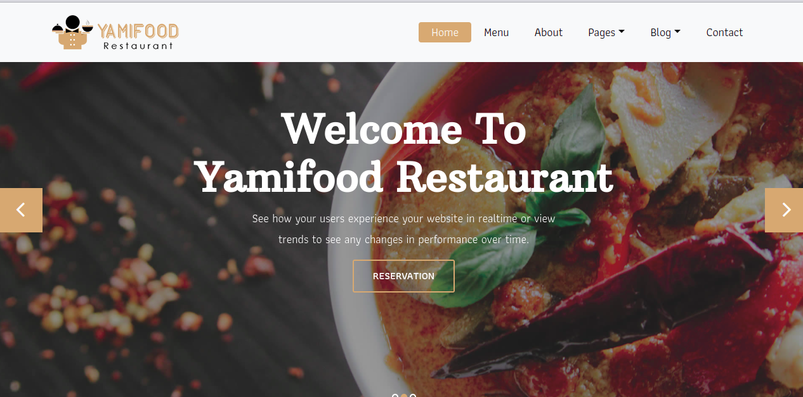

# HOTEL-WEBSITE
Website for hotel build using HTML, CSS and Javascript
Backend built on Django

## Objective
The objective of Hotel website to manage hotel information i.e
### Display Menu card
### Room avaibility

## Installation
Clone repository
> git clone https://github.com/shavejshaikh/Hotel-Website.git

> cd Hotel-Website

Install dependency from requirements.txt
> pip install -r requirements.txt

Migrate database 
> python3 manage.py makemigrations

> python3 manage.py migratez

Run django application
> python3 manage.py runserver

